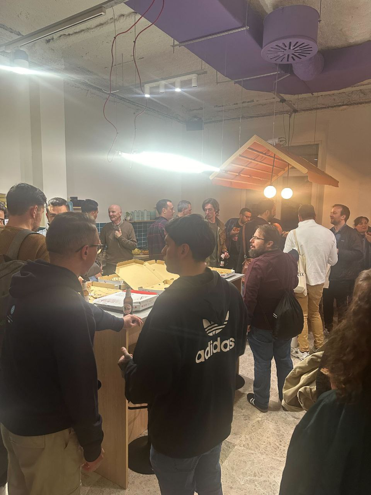
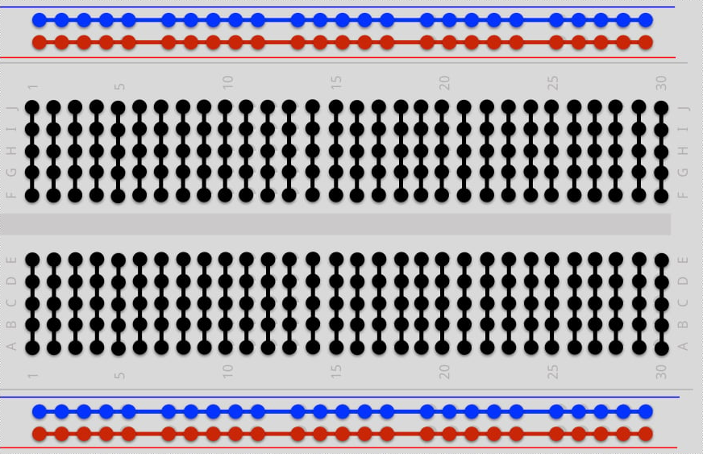
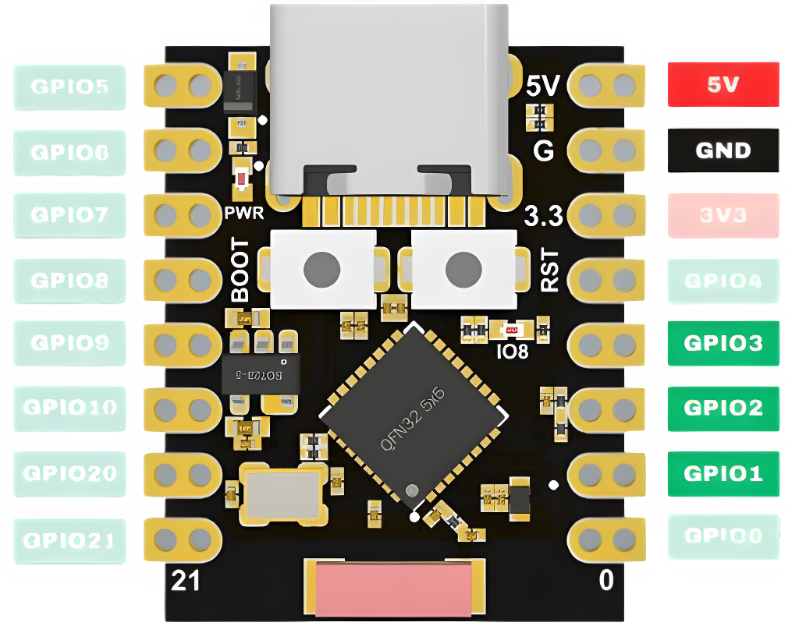
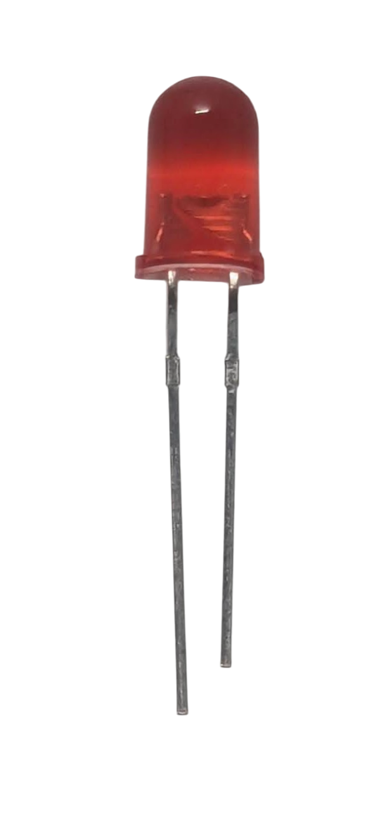
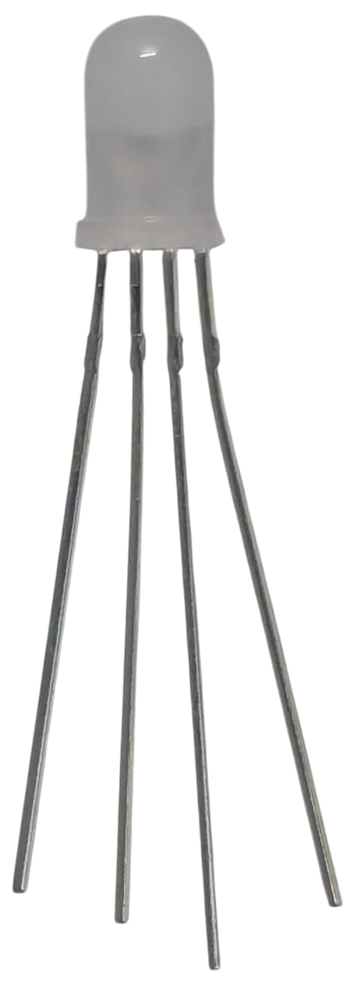
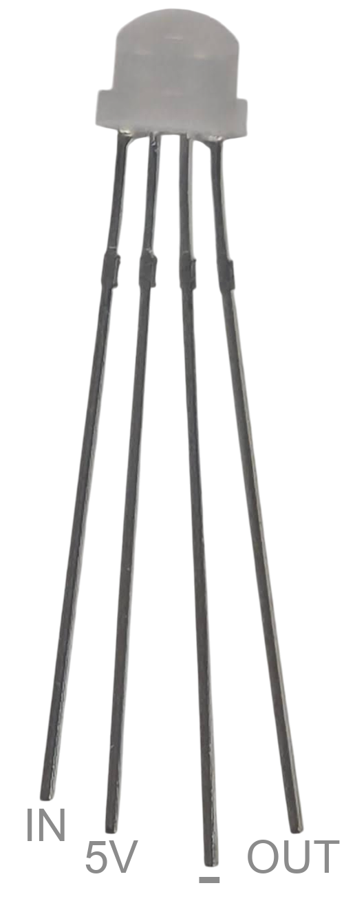
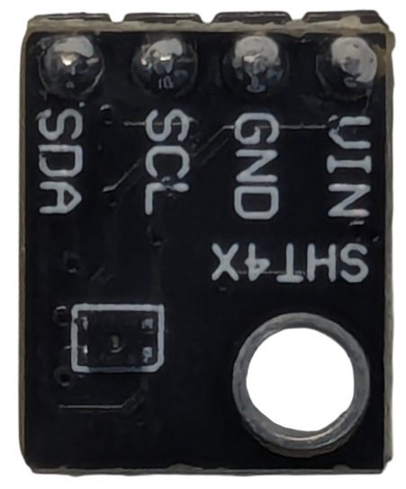
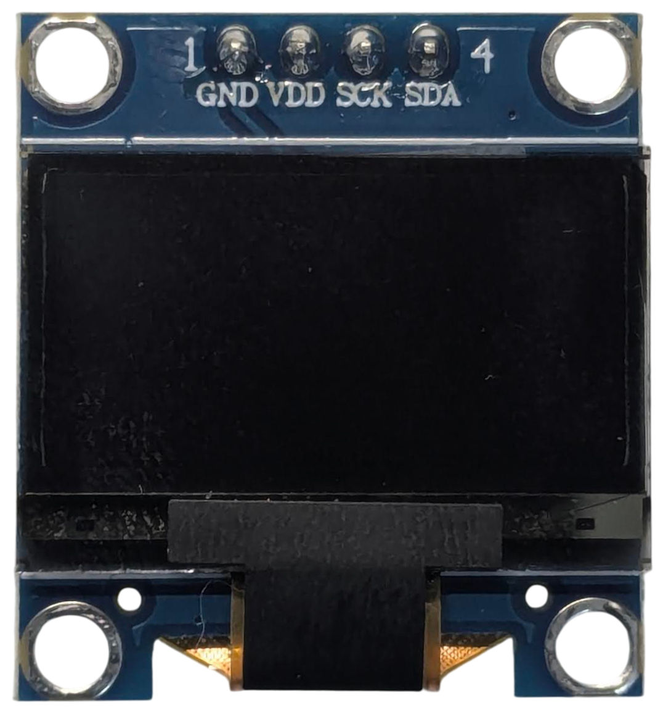

.. toctree::
   :glob:
   :hidden:

   *

.. _intro:

#######################
*Taller de* Micropython
#######################

.. revealjs-section::
    :data-background-color: #36760d
    :data-transition-speed: slow
    :data-transition: fade

**Programación fácil y para todos de microcontroladores**

.. revealjs-notes::

  Hola a todos, muchas gracias por venir.

Sin **conocimientos** previos
=============================

.. revealjs-section::
    :data-background-color: #000000
    :data-background-image: _static/electronic_classroom.jpg

.. revealjs-notes::

   Este es un taller de microcontroladores con Micropython, el cual no requiere de conocimientos previos ni de
   Micropython, ni de microcontroladores ni de electrónica. Iremos desde el principio, pero estoy seguro que quienes
   tengáis ya experiencia, también aprendáis algo nuevo.

Ordenador **obligatorio**
=========================

.. revealjs-section::
    :data-background-color: #333333
    :data-background-video: _static/laptop.mp4
    :data-background-video-loop: true
    :data-background-size: cover

.. revealjs-notes::

   Durante este taller, será necesario el uso de un ordenador con conexión a Internet. Si no habéis traído uno,
   podréis atender y mirar las prácticas de los compañeros.

Conexión **WiFI**
=================

.. revealjs-section::
    :data-background-color: #000000
    :data-background-image: _static/wireless_background.png
    :data-background-size: cover

.. revealjs-notes::

   Vamos a lo primero, la conexión WiFi. Esperemos que vaya bien la red de la organización...
   ¿Vais teniendo ya conexión? ¿Cómo os funciona?

QR
==

.. revealjs-section::
    :data-background-color: #4973ff
    :data-transition-speed: slow
    :data-transition: fade

.. revealjs-notes::

   Vale, ahora que os vais conectando, id entrando a esta presentación, la cual usaremos durante todo el taller.
   Os espero unos segundos... ¿Os abre bien?

Kits de componentes
===================

.. revealjs-section::
    :data-background-color: #000000

.. revealjs-notes::

   Bien, como podréis haber adivinado, en este taller usaremos kits de componentes para trabajar, los cuales requieren
   del ordenador. Aquí tengo los kits, pero sólo dispongo de 15. ¿Quiénes habéis mirado antes de venir los requisitos
   y tenéis ya Internet? ¿quiénes ya estáis preparados con la presentación abierta en Google Chrome? Os voy
   repartiendo.

Simulador **online**
====================

.. revealjs-section::
    :data-background-color: #333333
    :data-background-video: _static/wokwi.mp4
    :data-background-video-loop: true
    :data-background-size: cover

.. revealjs-notes::

   Los que no tengáis kit, no os preocupéis, que también usaremos un simulador online. También podréis viendo ayudando
   a quienes tengan kit, luego os pediré que os cambiéis de sitio para ver las prácticas, cuando ya estén repartidos
   los kits de forma definitiva.

**Hello** world
===============

.. revealjs-section::
    :data-background-color: #090a0f

.. micropython-demo::
    :video: _static/demo0.mp4

    print(" ".join(["hello", "world"]))

.. revealjs-notes::

   Para comprobar el microcontrolador, conectad por USB, y en esta diapositiva pulsad en el botón de conectar, elegid
   el dispositivo, el cual suele ser algo así como USB JTAG y en el botón de ejecutar.

Posibles **problemas**
----------------------

.. revealjs-section::
    :data-background-color: #090a0f

.. revealjs-fragments::

    * 🐧 **GNU/Linux**. No está en el grupo dialout o no están las reglas de udev `(ver solución) <https://github.com/Nekmo/micropython-workshop/blob/master/demos/demo0/TROUBLESHOOTING.rst#gnulinux>`_.
    * 🪟 **Windows y Mac**. No están los drivers instalados `(ver solución) <https://github.com/Nekmo/micropython-workshop/blob/master/demos/demo0/TROUBLESHOOTING.rst#windows>`_.

.. revealjs-notes::

   Si no os funciona a la primera, pasadle por favor el kit a otra persona, no os quedéis sin usarlo. Mientras tanto,
   intentad estas soluciones según vuestro sistema. A los que tenéis GNU/Linux, os recomiendo ir mirando la solución,
   antes de recibir el kit de otro compañero, para ganar tiempo. Cuando lo tengáis resuelto, esperad que os llegue
   un kit y probad de nuevo.

Sobre mí **Nekmo**
==================

.. revealjs-section::
    :data-background-color: #090a0f
    :data-transition-speed: slow
    :data-transition: fade

+------------------------------------+
|                                    |
| .. image:: images/cara.svg         |
|   :width: 200px                    |
|                                    |
| *Programador Python*               |
|                                    |
+------------------------------------+

.. revealjs-notes::

   Ahora, mientras vais probando los kits, dejadme presentarme... Soy Juan José, aunque muchos me conocen en redes
   como Nekmo, y puede que me conozcáis por charlas anteriores tanto aquí como en Python Málaga.

Otras **charlas**...
====================

.. image:: images/talks1.jpg
   :width: 32%
   :align: center

----------

.. image:: images/python-malaga-logo-white.png
   :width: 10%
   :align: center

.. image:: images/plytix-logo-white.svg
   :width: 35%
   :align: center

.. revealjs-section::
    :data-background-color: #090a0f

.. revealjs-notes::

   Si venís de Málaga, os recomiendo echarle un ojo a nuestra asociación, donde hacemos charlas tan chulas como la
   que veis en las fotos. Hemos hecho concursos, networking, y mucho más. Las imágenes son de un evento del año
   pasado en las oficinas para las que trabajo, en Plytix. *Permitidme preguntar, ¿cuántos tenéis ya funcionando
   el kit?*

Microcontroladores
==================

.. revealjs-section::
    :data-background-color: #000000
    :data-background-image: _static/microcontrollers_background.png

.. revealjs-notes::

   No os preocupéis si os seguís peleando con ello, sólo recordad pasarle el kit a otro mientras
   equipo. Mientras, voy a ir hablando de los microcontroladores.

¿Qué son?
---------

.. revealjs-section::
    :data-background-color: #090a0f

.. revealjs-fragments::

    * **Ventajas**

      * 🤏 Pequeños
      * 🤑 Económicos
      * 🪫 Bajo consumo

    * **Desventajas**

      * 🐢 Poco potentes
      * 😓 Programación más compleja

.. revealjs-notes::

   Como os podréis imaginar por el nombre, los microcontroladores son pequeños ordenadores, como puede ser una Raspberry
   Pi, pero mucho más pequeños y con menos recursos. Entre sus ventajas tenemos [...] y entre sus desventajas [...].

Algunos **usos**
----------------

.. revealjs-section::
    :data-background-color: #090a0f

.. revealjs-fragments::

    * ☁️ Domótica
    * 🤖 Robótica
    * 🔌 Electrónica
    * 🚧 Prototipos
    * ...

.. revealjs-notes::

   Se utilizan en muchos ámbitos, como la domótica, robótica, electrónica, prototipos y muchos más. *Veremos algunos
   ejemplos finales como este coche teledirigido, o este dron*.

GIF robot
---------

.. revealjs-section::
    :data-background-color: #333333
    :data-background-video: _static/robot_fall.mp4
    :data-background-video-loop: true
    :data-background-size: cover

.. revealjs-notes::

   Gracias a ellos, podréis competir contra Boston Dynamics en robótica, y conseguir imágenes graciosas como esta.

Variantes
---------

.. revealjs-section::
    :data-background-color: #090a0f

.. revealjs-fragments::

    * **ESP8266/ESP32**

      * 🤑 Muy **económico**
      * 😄 Múltiples **variantes**
      * 👥 Gran **comunidad**

    * **Raspberry Pi Pico**

      * 💸 **Económico**
      * 🔨 Gran **soporte**
      * 📚 Bien **documentado**

.. revealjs-notes::

   Entre los microcontroladores que soportan Micropython podemos destacar los ESP8266 y ESP32 [...] o la Raspberry Pi
    Pico [...], u otros más caros como la PyBoard, la oficial de Micropython.

ESP32
=====

.. revealjs-section::
    :data-background-color: #000000
    :data-background-image: _static/esp32_background.jpg

.. revealjs-notes::

   Pero en este taller vamos a utilizar un ESP32, porque sencillamente...

Dinero
------

.. revealjs-section::
    :data-background-color: #333333
    :data-background-video: _static/empty_wallet.mkv
    :data-background-video-loop: true
    :data-background-size: cover

.. revealjs-notes::

   ... la pela es la pela. Y es que son los más económicos. El microcontrolador que tenéis delante vuestra, cuesta
   entre 1.5€ aproximadamente. *Y hablando del ESP32, ¿cómo lleváis los kits? Aún tengo para rato, por lo que podéis
   probando, descuidad...*

Características
---------------

.. revealjs-section::
    :data-background-color: #090a0f

.. revealjs-fragments::

    * 💪 **Doble** núcleo
    * 🛜 Conectividad **WiFi**
    * 📡 Conectividad **Bluetooth**
    * 🔌 Múltiples pines **GPIO**
    * 📟 **ADC** / **DAC**

.. revealjs-notes::

   Pero no sólo es barato. También tiene un montón de características interesantes como [...].

Micropython
===========

.. image:: images/micropython-logo.svg
   :width: 35%
   :align: center

.. revealjs-section::
    :data-background-color: #090a0f

.. revealjs-notes::

   Si recordáis, hemos dicho como uno de sus puntos débiles que son difíciles de programar. Y hasta hace no mucho era
   así. Pero desde hace unos años, tenemos algunas soluciones como Micropython que nos permiten programar estos
   microcontroladores de una forma más sencilla. Micropython es una variante de Python 3 reducida y adaptada para
   algunos de estos microcontroladores.

**Primeros** pasos
------------------

.. revealjs-section::
    :data-background-color: #090a0f

.. revealjs-fragments::

    * ⚡ **Flashear** siguiendo la web de `Micropython <https://micropython.org/>`_
    * 📝 **IDE web** `(ViperIDE) <https://viper-ide.org/>`_, local `(Thonny) <https://thonny.org/>`_
      o **esta presentación**
    * ▶️ **Simulador online** `(Wokwi) <https://wokwi.com/>`_.

.. revealjs-notes::

   Y empezar con Micropython es muy sencillo. Sólo tenéis que descargar el binario del sitio web oficial, y flashearlo
   mediante la herramienta indicado. Los microcontroladores que tenéis, ya los he flasheado yo en casa. Tras ello,
   podéis usar un IDE web como Viper IDE, o un IDE local como Thonny. También podéis usar un simulador online como
   Wokwi, si no tenéis un microcontrolador físico. Y aunque lo tengáis, os recomiendo utilizarlo, ya que os permitirá
   probar cosas sin miedo a romper nada.

¿Por qué **Micropython**?
-------------------------

.. revealjs-section::
    :data-background-color: #090a0f

.. revealjs-fragments::

    * **Ventajas**

      * 😄 **Fácil** de aprender
      * 🚀 **Prototipado** rápido
      * 🔋 **Pilas incluidas**

    * **Desventajas**

      * 🐢 Más **lento**
      * 📦 Menos **módulos**
      * 📏 Menos **memoria**

.. revealjs-notes::

   ¿Y por qué usar Micropython? Entre sus ventajas tenemos [...] y entre sus desventajas [...]. Aún así, es una
   herramienta fantástica para iniciarse en este mundillo, y es genial para prototipar ideas rápidamente.

Nos **recolocamos**
===================

.. revealjs-section::
    :data-background-color: #000000
    :data-background-image: _static/juego_sillas.jpg

.. revealjs-notes::

    Y listas las presentaciones, vamos a movernos un poco para quienes no tengan un kit también puedan ver y colaborar.
    Vamos, que es como si jugásemos a las sillas. Levantad la mano quienes tengáis un kit. Perfecto. Vamos a intentar
    entre todos, que quienes no tengan kit, tengan la oportunidad de ver y colaborar en las prácticas.

Lo básico de **electrónica**
============================

.. revealjs-section::
    :data-background-color: #090a0f

.. revealjs-fragments::

    * ⚡ La mayoría de los componentes son **polarizados**.
    * 🌍 Todos los componentes deben ir a **tierra** (cable *negro*).
    * 💡 Usar **resistencias** con los *LED*.

.. revealjs-notes::

   Y mientras termináis de asentaros, vamos a reparas algunas cosas básicas de electrónica. Recordar: [...]

Protoboard
----------

.. revealjs-section::
   :data-background-color: #DDDDDD

.. revealjs-notes::

   Para las prácticas, usaremos una protoboard. En esta, las filas del centro están conectadas entre sí,
   y las columnas de los lados, que usaremos para tierra y el voltaje (esto último sólo en las últimas
   prácticas), también están conectadas entre sí. Aprovecharemos esto para hacer uniones entre cables y
   componentes.

Avisos de **seguridad**
-----------------------

.. revealjs-section::
    :data-background-color: #090a0f

.. revealjs-fragments::

   * 🚫 **NUNCA cortocircuitar** pines.
   * ⚠️ **CUIDADO** con el **pin de 5V**.
   * 👁️ **Fijarse** bien antes de conectar cables y componentes.

.. revealjs-notes::

   Y por último, pero no más importante, unos avisos importantes de seguridad: [...].

Demos
=====

.. revealjs-section::
    :data-background-color: #333333
    :data-background-video: _static/resistor_fire.mp4
    :data-background-video-loop: true
    :data-background-size: cover

.. revealjs-notes::

   Y ahora, seguro que queréis que empecemos a hacer cosas. Esperemos que no tengamos ninguna desgracia.

Encender un **led**
===================

.. revealjs-section::
    :data-background-color: #333333
    :data-background-video: _static/leds.mp4
    :data-background-video-loop: true
    :data-background-size: cover

.. revealjs-notes::

   Vamos a empezar por lo más sencillo de todo. Encender un led. El ejemplo más típico de todos.

Identificar **los pines**
-------------------------

.. revealjs-section::
   :data-background-color: #DDDDDD

.. revealjs-notes::

   Aunque antes de empezar cualquier circuito, es imprescindible identificar los pines de nuestro controlador. Aquí
   tenéis los pines de nuestro ESP32. De momento sólo trabajaremos con el GPIO 1 y la tierra. Cuidado al identificar
   la tierra, ya que está justo al lado del pin de 5V, el cual no debemos usar de momento.

**Conectar** el led
-------------------

.. revealjs-section::
   :data-background-color: #DDDDDD

* `✏️ Ejercicio sin resolver <https://wokwi.com/projects/441387172284308481>`_
* `✅ Ejercicio resuelto <https://wokwi.com/projects/441386639666392065>`_

.. revealjs-notes::

   Para nuestro circuito, necesitaremos un LED como el que tenéis en la imagen. Necesitaremos además una resistencia
   para protegerlo. Aquí debajo tenéis enlaces al simulador online Wokwi. Empezaremos con el ejercicio sin resolver, y
   siendo el primero, voy a resolverlo yo primero junto con vosotros.

Código **led**
--------------

.. revealjs-section::
    :data-background-color: #090a0f

.. micropython-demo::
    :video: _static/demo1.mp4

    from machine import Pin
    from time import sleep

    led = Pin(1, Pin.OUT)

    while True:
        led.on()
        sleep(0.5)
        led.off()
        sleep(0.5)

LED **analógico**
=================

.. revealjs-section::
   :data-background-color: #DDDDDD

.. video:: _static/led_breathing.mkv
   :width: 60%
   :autoplay:
   :loop:
   :muted:

* `✏️ Ejercicio sin resolver <https://wokwi.com/projects/441387365772801025>`_
* `✅ Ejercicio resuelto <https://wokwi.com/projects/440571798883168257>`_

.. revealjs-notes::

   Ahora, sin cambiar nada en el circuito, vamos a hacer que el led varíe su intensidad. Mientras que en el anterior
   ejemplo sólo se comportaba de forma digital, es decir, encendido o apagado, en este caso lo haremos de forma
   analógica, lo cual nos permitirá variar su intensidad. En esta ocasión, os dejo a vosotros resolver el ejercicio, y
   luego lo vemos juntos.

Código led **analógico**
------------------------

.. revealjs-section::
    :data-background-color: #090a0f

.. micropython-demo::
    :video: _static/demo2.mp4

    from machine import Pin, PWM
    from time import sleep

    led = Pin(1)
    pwm = PWM(led)

    while True:
        for i in range(0, 1024, 10):
            pwm.duty(i)
            sleep(0.01)
        for i in range(1023, -1, -10):
            pwm.duty(i)
            sleep(0.01)

GIF luces LED
-------------

.. revealjs-section::
    :data-background-color: #333333
    :data-background-video: _static/house_leds.mp4
    :data-background-video-loop: true
    :data-background-size: cover

.. revealjs-notes::

   Y ahora, ya sabéis cómo llenar vuestra casa de lucecitas LED.

Conectar **un botón**
=====================

.. revealjs-section::
   :data-background-color: #DDDDDD

* `Ejercicio sin resolver <https://wokwi.com/projects/441388877026727937>`_
* `Ejercicio resuelto <https://wokwi.com/projects/440572379251171329>`_

.. revealjs-notes::

   No sólo podemos entregar valores de salida. También podemos leer valores de entrada, como es el caso con el botón
   que tenéis en la imagen. El circuito es similar al del LED, pero en este caso no usaremos una resistencia, ya que el
   propio microcontrolador tiene una resistencia pull-up interna, la cual debemos configurar para usarla. Tened en
   cuenta que el botón tiene 4 patillas, estando unidas a pares. Las patillas que están unidas, son las que están más
   lejos entre sí. Haremos con el ejercicio igual que antes, pero esta vez tendréis que hacer el circuito.

**Código** botón
----------------

.. revealjs-section::
    :data-background-color: #090a0f

.. micropython-demo::
    :video: _static/demo3.mp4

    from machine import Pin, UART
    from time import sleep

    button = Pin(1, Pin.IN, Pin.PULL_UP)

    while True:
        state = not button.value()
        print(int(state))
        sleep(0.1)

GIF recreativa
--------------

.. revealjs-section::
    :data-background-color: #333333
    :data-background-video: _static/arcades.mp4
    :data-background-video-loop: true
    :data-background-size: cover

.. revealjs-notes::

   Con esto, ya estáis capacitados para crear vuestra propia recreativa con todos los botones que queráis.

Conectar un **LED RGB**
=======================

.. revealjs-section::
   :data-background-color: #DDDDDD

* `Ejercicio sin resolver <https://wokwi.com/projects/441390660052679681>`_
* `Ejercicio resuelto <https://wokwi.com/projects/440573050467784705>`_

.. revealjs-notes::

   Y para vuestra recreativa, no pueden faltar LEDs RGB a todo color. Como muchos sabréis, las siglas de RGB proceden de
   Red, Green y Blue, que son los colores primarios de la luz. Cada uno de estos colores corresponderá a un pin GPIO,
   por lo que esta vez necesitaremos tres pines, y un cuarto pin para tierra. De la imagen, el pin de tierra es el más
   largo, y los otros tres son los de los colores. Recordad usar resistencias por cada pin de color. El circuito es
   igual que el del LED normal, pero con 3 LEDs en uno solo. Ahora, os dejo con el ejercicio.

**Código** LED RGB
------------------

.. revealjs-section::
    :data-background-color: #090a0f

.. micropython-demo::
    :video: _static/demo4.mp4

    from machine import Pin, PWM
    from time import sleep
    import urandom

    r = PWM(Pin(1), freq=1000)
    g = PWM(Pin(2), freq=1000)
    b = PWM(Pin(3), freq=1000)

    def set_color(red, green, blue):
        r.duty(red)
        g.duty(green)
        b.duty(blue)

    while True:
        red = urandom.getrandbits(10)
        green = urandom.getrandbits(10)
        blue = urandom.getrandbits(10)
        set_color(red, green, blue)
        sleep(1)

GIF cientos de cables
---------------------

.. revealjs-section::
    :data-background-color: #333333
    :data-background-video: _static/cables.mp4
    :data-background-video-loop: true
    :data-background-size: cover

.. revealjs-notes::

   Pero claro, si quisiésemos tener varios leds RGB, cada uno con su color, necesitaríamos un montón de cables y ocupar
   todos los pines GPIO de nuestra placa, los cuales son muy valiosos. Para ello disponemos de protocolos de
   comunicación, que nos permiten comunicarnos con varios dispositivos a la vez.

**Protocolos** de comunicación
==============================

.. revealjs-section::
    :data-background-color: #090a0f

.. revealjs-fragments::

    * 1️⃣ **OneWire** (1 pin)
    * 2️⃣ **I2C** (2 pines)
    * 3️⃣ **SPI** (3/4+ pines)
    * 📟 **UART** (2+ pines)

.. revealjs-notes::

   Disponemos de diferentes protocolos de comunicación, que suelen variar en el número de pines, en su velocidad,
   su uso, etc. Por ejemplo, oneWire sólo llega a necesitar un pin, pero es muy lento. I2C sólo necesita 2 pines, siendo
   muy popular. SPI parte de 3 a 4 pines, pudiendo requerir más si tenemos varios dispositivos. UART, que algunos
   recordaréis de los serial bus, parte de 2 pines... y así podríamos continuar. También tenemos protocolos específicos
   y diseñados para casos concretos, como el que veremos ahora. Recordad que con cada protocolo, necesitaremos utilizar
   adicionalmente una tierra, que no se cuenta como pin de comunicación.

Conectar un **led WS2812**
==========================

.. revealjs-section::
   :data-background-color: #DDDDDD

* `Ejercicio sin resolver <https://wokwi.com/projects/441391974099865601>`_
* `Ejercicio resuelto <https://wokwi.com/projects/440574036913642497>`_

.. revealjs-notes::

   Vamos a empezar con el protocolo WS2812, o APA106, que es el que utilizan los LEDs RGB de tipo NeoPixel. Este
   protocolo unidireccional sólo necesita un pin de datos, pudiendo conectar varios LEDs a la vez, cada uno con su
   color. En la imagen tenéis un LED de tipo Neopixel, no lo confundáis con el anterior. Cada patilla tiene su longitud.
   El pin más largo es 5V, el que está a su lado izquierdo es el de tierra, el más corto es el de datos, y el que está
   al otro lado es la salida, que nos permitirá conectar más LEDs en cadena. Cuando hagáis el circuito, no
   conectéis el pin de 5V hasta que estéis seguros de que todo está bien, y fijaros bien en los pines, o quemaréis el
   LED. Ahora, os dejo con el ejercicio.

**Código** LED WS2812
---------------------

.. revealjs-section::
    :data-background-color: #090a0f

.. micropython-demo::
    :video: _static/demo5.mp4

    from machine import Pin
    from apa106 import APA106
    from time import sleep

    NUM_LEDS = 3

    pin = Pin(1)
    leds = APA106(pin, NUM_LEDS)
    colors = [
        (255, 0, 0),
        (0, 255, 0),
        (0, 0, 255),
    ]
    offset = 0

    while True:
        for num_led in range(NUM_LEDS):
            next_color = colors[(num_led + offset) % NUM_LEDS]
            leds[num_led] = next_color
        leds.write()
        offset = (offset + 1) % NUM_LEDS
        sleep(0.5)

**I2C**
=======

.. revealjs-section::
    :data-background-image: _static/i2c_background.png
    :data-background-size: cover

.. revealjs-notes::

   Aunque el protocolo WS2812 nos permite controlar múltiples LEDs individualmente con un solo cable, es un protocolo
   unidireccional diseñado en exclusiva para LEDs. En cambio, tenemos otros protocolos como I2C, que nos permiten
   comunicarnos con otros dispositivos, como pantallas, sensores, etc. Es un protocolo bidireccional que como dijimos
   antes, sólo necesita 2 pines. Para esta práctica, vamos a conectar una pantalla y un sensor a un mismo I2C. A los
   que hayáis terminado el ejercicio anterior, ahora os daré el kit para esta práctica, de la cual sólo tengo 5. Si
   os quedáis esperando, os puedo dar otros componentes para que hagáis más pruebas.

Conectar **sensor** y **pantalla I2C**
======================================

.. revealjs-section::
   :data-background-color: #DDDDDD

* `Ejercicio sin resolver <https://wokwi.com/projects/441394565508740097>`_
* `Ejercicio resuelto <https://wokwi.com/projects/441393628155164673>`_

.. revealjs-notes::

   Para esta pŕactica, vamos a conectar tanto la pantalla como un sensor de temperatura a un mismo I2C, el cual utiliza
   2 pines, SDA y SCL. Necesitaremos además una tierra y una alimentación. Cada dispositivo I2C tiene una dirección
   única, la cual debemos conocer para comunicarnos con él. No obstante, podemos utilizar el escáner I2C para conocer
   la dirección de nuestros dispositivos. En este caso, la pantalla es una OLED de 128x64 píxeles, y el sensor un SHT41
   para medir la temperatura y humedad. No necesitaremos resistencias, y qué es cada pin está indicado en el componente.
   Vamos ahora con el ejercicio.

**Código** sensor y pantalla I2C
--------------------------------

.. revealjs-section::
    :data-background-color: #090a0f

.. micropython-demo::
    :video: _static/demo6.mp4

    from machine import Pin, I2C
    from time import sleep
    from ssd1306 import SSD1306_I2C
    from sht4x import SHT4X

    scl = Pin(1)
    sda = Pin(2)
    i2c = I2C(0, scl=scl, sda=sda)
    print(i2c.scan())

    oled = SSD1306_I2C(128, 64, i2c, 0x3C)
    sensor = SHT4X(i2c, 0x44)

    while True:
        temperature, humidity = sensor.measurements
        oled.fill(0)
        temperature_text = "Temp: {:.1f} C".format(temperature)
        humidity_text = "Hum:  {:.1f} %".format(humidity)
        oled.text(temperature_text, 0, 10)
        oled.text(humidity_text, 0, 30)
        oled.show()
        sleep(2)

**WiFi** y **bluetooth**
========================

.. revealjs-section::
    :data-background-image: _static/wireless_background.png
    :data-background-size: cover

.. revealjs-notes::

   Pero no sólo disponemos de protocolos de comunicación alámbrica, es decir, cableada. Todos los modelos de ESP32,
   como el que tenéis delante, cuentan con WiFi y bluetooth. Y algunos modelos también Zigbee.

**Código** coche
----------------

.. revealjs-section::
    :data-background-color: #090a0f

.. revealjs-section::
    :data-background-color: #000303

.. micropython-demo::
    :video: _static/demo7.mp4

    import json
    import time
    import network
    import web
    from hardware import I2C
    from hardware import Pin
    from web import WebSocket
    import uasyncio as asyncio

    i2c0 = I2C(0, scl=Pin(26), sda=Pin(0), freq=400000)
    i2c0.writeto_mem(0x38, 0x00, bytearray([0, 0, 0, 0]))

    ap = network.WLAN(network.AP_IF)
    ap.active(True)
    ap.config(essid='roverc.pro', password='roverc.pro', authmode=network.AUTH_WPA_WPA2_PSK)

    while not ap.active():
        time.sleep(1)

    ip = ap.ifconfig()[0]
    print('IP:', ip)

    app = web.App(host='0.0.0.0', port=80)

    def normalize_value(value: int | float) -> bytes:
        value = int(value)
        if value >= 128:
            value = 127  # The maximum value in positive is 127
        if value < 0:
            value = (256 + value)
        return value.to_bytes(1, "big")

    def coords_to_mecano_wheels(x: int, y: int, maximum: int = 127):
        r1 = x + y
        r2 = -x + y
        r3 = -x + y
        r4 = x + y
        values = [r1, r2, r3, r4]
        max_val = max(abs(v) for v in values)
        if max_val > maximum:
            factor = maximum / max_val
            values = [v * factor for v in values]
        return [normalize_value(v) for v in values]

    async def serve_static(w, filename, mimetype):
        # write http headers
        w.write('HTTP/1.0 200 OK\r\n')
        w.write(f'Content-Type: {mimetype}; charset=utf-8\r\n')
        w.write('\r\n')
        # write page body
        with open(filename, 'r') as f:
            w.write(f.read())
        # drain stream buffer
        await w.drain()

    # root route handler
    @app.route('/')
    async def handler(r, w):
        return await serve_static(w, "index.html", "text/html")

    # root route handler
    @app.route('/joy.min.js')
    async def serve_script(r, w):
        return await serve_static(w, "joy.min.js", "application/javascript")

    # /ws WebSocket route handler
    @app.route('/ws')
    async def ws_handler(r, w):
        # upgrade connection to WebSocket
        ws = await WebSocket.upgrade(r, w)
        latest = None
        while True:
            evt = await ws.recv()
            if evt is None or evt['type'] == 'close':
                # handle closed stream/close event
                break
            elif evt['type'] == 'text':
                # print received messages and echo them
                print('Received:', evt['data'])
                data = json.loads(evt['data'])
                if "x" in data and "y" in data:
                    x, y = data['x'], data['y']
                    if (x, y) == latest:
                        continue
                    try:
                        wheel1, wheel2, wheel3, wheel4 = coords_to_mecano_wheels(x, y)
                    except OverflowError:
                        continue
                    print("Wheels:", *(w[0] for w in (wheel1, wheel2, wheel3, wheel4)))
                    i2c0.writeto_mem(0x38, 0x00, b"".join([wheel1, wheel2, wheel3, wheel4]))
                    latest = x, y
                elif "claw" in data:
                    value = 8 if data["claw"] else 87
                    i2c0.writeto_mem(0x38, 0x10, value.to_bytes(1, 'big'))

    # Start event loop and create server task
    loop = asyncio.get_event_loop()
    loop.create_task(app.serve())
    loop.run_forever()

.. revealjs-notes::

   En este último ejemplo no me voy a extender mucho. Inicializamos un access point, y un servidor web con soporte para
   websockets, el cual permite conectarnos al coche y controlarlo desde el navegador.

Demo **coche**
--------------

.. revealjs-section::
   :data-background-color: #DDDDDD

.. raw:: html

    <iframe src="http://192.168.4.1/" height="600px" width="100%" style="border: 0;"></iframe>

.. revealjs-notes::

   ¡Ahora, vamos a ver el coche en acción!

¡Pruébalo tú mismo!
-------------------

.. revealjs-section::
   :data-background-color: #DDDDDD

* **SSID:** roverc.pro
* **Password:** roverc.pro
* **Url:** http://192.168.4.1

.. revealjs-notes::

   Y por si os sabe a poco, ¡os invito a probarlo vosotros mismos! Conectad vuestro móvil al wifi del coche, y acceded a
   la dirección indicada.

ESP-Now
=======

.. revealjs-section::
    :data-background-image: _static/wireless_background.png
    :data-background-size: cover

.. revealjs-notes::

   Además, Espressif, la empresa detrás de los ESP, ha desarrollado un protocolo de comunicación propio que se encuentra
   disponible en Micropython, basado en WiFi. Es más sencilllo de utilizar, tiene una menor latencia, un mayor alcance,
   y un menor consumo que el WiFi tradicional. Es un protocolo perfecto para por ejemplo...

Demo **dron**
--------------

.. revealjs-section::
   :data-background-color: #DDDDDD

.. revealjs-notes::

   ¡Un dron!

¡Muchas gracias a todos!
========================

.. revealjs-section::
    :data-background-gradient: linear-gradient(-45deg, #ee7752, #e73c7e, #23a6d5, #23d5ab);

.. revealjs-notes::

    Y mientras os dejo jugando con el coche... ¡Hasta aquí la presentación! Espero que hayáis disfrutado y aprendido
    algo nuevo. Sé que he ido muy rápido, pero si tenéis dudas, estoy disponible para resolverlas.

Recursos
========

.. revealjs-section::
    :data-background-color: #333333
    :data-transition-speed: default
    :data-transition: fade

.. revealjs-fragments::

    * 🌐 **Web oficial**: https://micropython.org
    * 📝 **Editor online**: https://viper-ide.org
    * 🥽 **Simulador online**: https://wokwi.com

.. revealjs-notes::

   Os dejo aquí disponibles estos recursos, para empezar a trabajar con Micropython.

Python **Málaga**
=================

.. revealjs-section::
    :data-background-color: #4973ff
    :data-transition-speed: slow
    :data-transition: fade

* 🌐 **Sitio web:** `python-malaga.es <https://www.python-malaga.es/>`_.
* 🤝 **Meetup:** `meetup.com/Python-Malaga <https://www.meetup.com/Python-Malaga/>`_.
* 🐦 **Twitter:** `@python_malaga <https://twitter.com/python_malaga>`_.
* ‍💼 **LinkedIn:** `linkedin.com/groups/13110576 <https://www.linkedin.com/groups/13110576/>`_.
* 📱 **Telegram:** `python_malaga <https://t.me/python_malaga>`_.

.. revealjs-notes::

   Y para más presentaciones, apuntaros a la comunidad de Python Málaga, donde hacemos más charlas como esta. No
   olvidéis seguirnos en nuestras redes sociales, y en nuestro grupo de Telegram.

**Contactar**
-------------

.. revealjs-section::
    :data-background-color: #333333
    :data-transition-speed: default
    :data-transition: fade

* 🌐 **Sitio web:** `nekmo.com <https://nekmo.com>`_
* 📫 **Email:** `contacto@nekmo.com <mailto:contacto@nekmo.com>`_
* 🐦 **Twitter:** `@nekmocom <https://twitter.com/nekmocom>`_
* 📱 **Telegram:** `@nekmo <https://t.me/nekmo>`_
* 💡 **Jabber:** `nekmo@nekmo.org <xmpp://nekmo@nekmo.org>`_

.. revealjs-notes::

   A cualquier cosa, tenéis mi contacto disponible.
